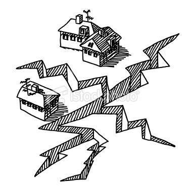

# leaflet-challenge

Created by [Celeste Muniz - Lithgow](https://github.com/celeste1030)

 

## Table of Contents
* [Objective](#objective)
* [How to View](#how-to-view)
* [Steps](#steps)
* [Technologies](#technologies)

## Objective

The **United States Geological Survey**, or **USGS** for short, is responsible for providing scientific data about natural hazards, the health of our ecosystems and environment. Their scientists develop new methods and tools to supply timely, relevant, and useful information about the Earth and its processes.

For this assignment, I developed a set of tools that will allow them visualize their **earthquake data**. They collect a massive amount of data from all over the world each day, and my objective is to create a meaningful way of displaying it. Visualizing their data will allow the USGS to better educate the public and other government organizations (and hopefully secure more funding..) on issues facing our planet.

## How to View

1. Download repo to your local drive.
2. Open in VS code.
3. Open index.html with Live Server.

## Steps

1. **Get the data set**

The [USGS GeoJSON Feed](http://earthquake.usgs.gov/earthquakes/feed/v1.0/geojson.php) provides earthquake data in a number of different formats, updated every 5 minutes. I chose to visualize all earthquakes from the past 7 days. I used the URL of this JSON to pull in the data for our visualization.

2. **Import & Visualize the Data**

* I created a map using Leaflet that plots all of the earthquakes from your data set based on their longitude and latitude.

* Data markers reflect the **magnitude of the earthquake by their size** and **depth of the earth quake by color**. Earthquakes with higher magnitudes should appear larger and earthquakes with greater depth should appear darker in color.

* I included popups that provide additional information about the earthquake when a marker is clicked.

*  Included a legend that will provide context for the map data.

## Technologies

Leaflet

D3

Java

Html

CSS
